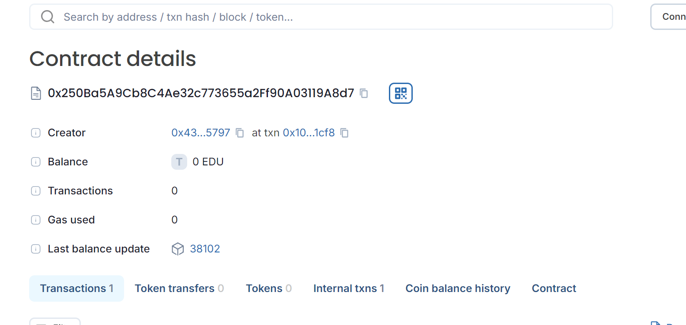

# Tuition Payment and Token Management


## Vision

The Tuition Payment and Token Management project aims to modernize the payment and reward system for educational institutions. By leveraging blockchain technology, this system allows students to pay their tuition fees using custom tokens (`TuitionToken`). Students can also earn additional tokens for making timely payments, enhancing the engagement and satisfaction of students with the institution.

## Project Features

- **TuitionToken Contract**: A token contract implementing ERC20-like functionality with minting capabilities for bonus rewards.
  - **Name**: Tuition Token
  - **Symbol**: TUT
  - **Decimals**: 18
  - **Minting**: Allows the contract owner to mint new tokens.
  - **Transfer and Allowance Management**: Facilitates the transfer of tokens and allowance delegation.

- **TuitionPayment Contract**: Manages installment plans for tuition payments.
  - **Create Installment Plan**: Allows students to create installment plans for their tuition fees.
  - **Make Payment**: Enables payment of installments using either tokens or ETH. It supports early payment bonuses in tokens.
  - **Refund Excess ETH**: Handles excess ETH sent during payment by refunding the difference.
  - **Get Installment Plan Status**: Provides information about the installment plans and their statuses.

## Future Scope

- **Enhanced Payment Options**: Integration with other cryptocurrencies or payment methods for greater flexibility.
- **Advanced Reward Mechanisms**: Implementation of more complex reward structures, such as tiered bonus systems.
- **User Interface**: Development of a web-based or mobile application for easier interaction with the smart contracts.
- **Integration with Educational Systems**: Linking the payment system with existing educational platforms for automatic fee management and reporting.
- **Security Enhancements**: Implementation of additional security measures and audits to ensure the robustness of the contracts.

## Project Structure

```
/project-root
  ├── contracts/
  │   ├── TuitionToken.sol
  │   └── TuitionPayment.sol
  ├── migrations/
  │   └── 1_deploy_contracts.js
  ├── test/
  │   ├── TuitionToken.test.js
  │   └── TuitionPayment.test.js
  ├── scripts/
  │   └── deploy.js
  ├── README.md
  └── package.json
```

- **`contracts`**: Contains the smart contracts for the project.
  - `TuitionToken.sol`: Implements the ERC20-like token with minting.
  - `TuitionPayment.sol`: Manages installment plans and payments.
- **`migrations`**: Includes deployment scripts for the smart contracts.
- **`test`**: Contains test cases for the smart contracts.
- **`scripts`**: Includes deployment and management scripts.
- **`README.md`**: Provides documentation and information about the project.
- **`package.json`**: Manages project dependencies and scripts.

## Developer Details

- **Author**: Ishika Agarwal
- **Email**: b23399@students.iitmandi.ac.in

## Deployment
- **chain Name**: Educhain Open Campus
- **Contract id**: 0x250ba5a9cb8c4ae32c773655a2ff90a03119a8d7
